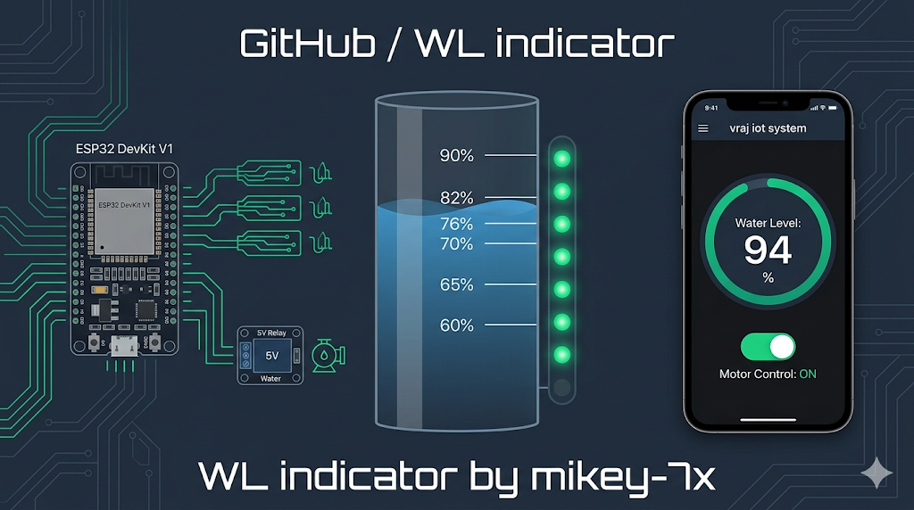
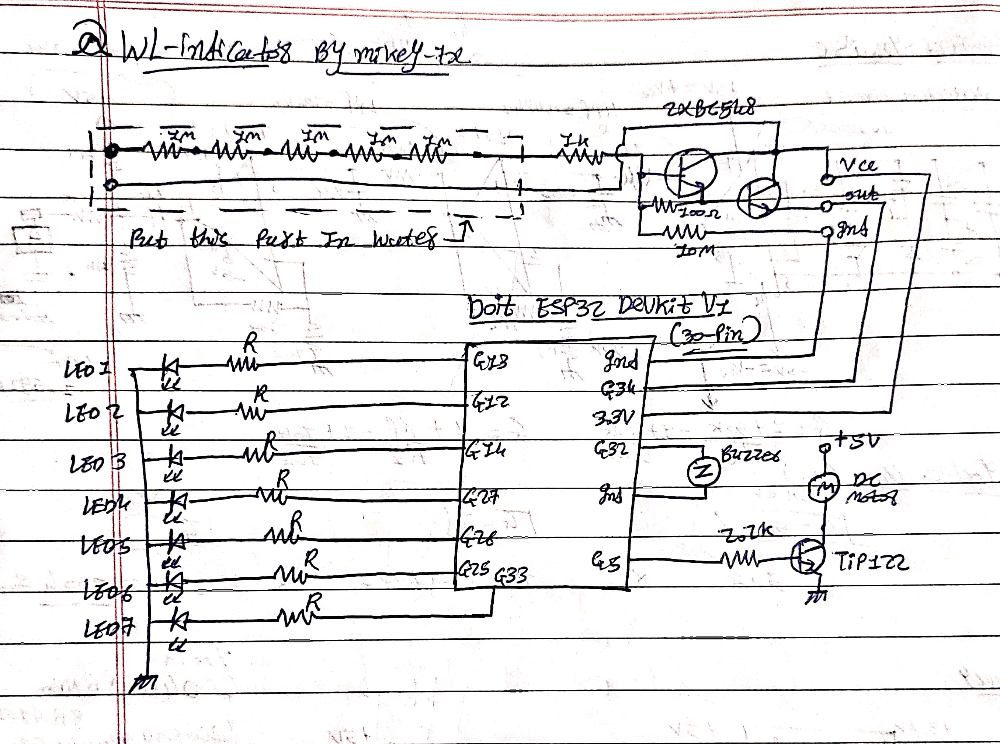

💧🌊WL Indicator (Water Level System) by mikey-7x

## Overview
A high professional, internet-of-things (IoT) solution for real-time monitoring and control of a seven-point water storage tank system. 

The **WL Indicator** is a dual-system architecture designed for absolute reliability and performance. It integrates custom **ESP32 Microcontroller C++ firmware** with a dedicated **Android Application (KivyMD)** developed asynchronously. The phone speaks directly to the ESP32 via a secure Wi-Fi bubble, completely eliminating the need for complex cloud servers or external data routers.

## 🚀 Key Engineering Features

* **Advanced Asynchronous UI:** The Android app utilizes a completely stutter-free, asynchronous threading architecture (`UrlRequest`). The visuals will **never freeze**, ensuring a buttery-smooth dashboard experience even if the ESP32 system is powered off or unresponsive.
* **Non-Linear Hardware Calibration:** Real-world water sensors rarely output data in a straight line. The firmware features advanced hardcoded **non-linear logic bands**, perfectly aligning the 7 physical LEDs and the digital app gauge to the Drastic conductance changes of the water sensor's PCB traces.
* **Standby Mode Power Efficiency:** The system is engineered to remain passive when the motor is off. The sensor does not collect measurements, the buzzer is silenced, the physical LED board is completely dark, and the app displays a passive state (`-- %`), activating instantly when the motor is toggled.
* **Modern Material Design:** A sleek, dark slate (#1E293B) theme with professional emerald green (#10B981) UI accents, following current-generation Material Design standards.
* **Critical Overfill Prevention:** The final water level band (90%) immediately triggers all 7 LEDs and sounds the physical buzzer simultaneously, preventing costly overspill before the system reaches absolute 100% voltage.

## 🥽 circuit Diagram 

## 🔌 Hardware Circuit & Pinout
The system is built on the **ESP32 DevKit V1 (30-pin board)**. You can view the full professional circuit diagram in the repository (see `circuit_diagram.jpg`).

| ESP32 Pin | Component | Function | Power |
| :--- | :--- | :--- | :--- |
| **V5 (VIN)** | **5V Relay Module** | Power for magnetic coil switching | 5V Input |
| **GND** | **Common Ground Rail** | Complete system common ground | - |
| **3V3** | **Water Sensor Module** | Safe sensor operating voltage | 3.3V Input |
| **G34 (Analog)** | **Water Sensor Module** | High-impedance Analog Signal Input | Output ➔ ESP32 |
| **G5 (Output)** | **5V Relay Module** | Relay IN/Signal (Stable boot pin) | Output ➔ Relay |
| **G32 (Output)** | **Active Buzzer** | High-decibel Alarm (Negative leg to GND) | Output ➔ Buzzer |
| **G13** | LED 1 | Lowest Level | progressive |
| **G12** | LED 2 | - | progressive |
| **G14** | LED 3 | - | progressive |
| **G27** | LED 4 | Middle Level | progressive |
| **G26** | LED 5 | - | progressive |
| **G25** | LED 6 | - | progressive |
| **G33** | LED 7 | Full Level Alarm | progressive |

## 🛠️ Software Installation

### 1. ESP32 Firmware (`WL_Indicator.ino`)
Upload this file using Arduino IDE or ArduinoDroid. It handles the Wi-Fi AP, the JSON status API, and the calibrated LED threshold logic.

* **SSID:** `Water_Level_System`
* **Password:** `password123`
* **Local API Endpoints:** `/status`, `/motor/on`, `/motor/off`

### 2. Android App (`main.py`)
This asynchronous KivyMD app fetches the ESP32's JSON data in the background.

* **Pre-compiled Binary:** Download the pre-compiled Android Application (`.apk`) from the **Releases** tab on the right.

## 📖 Usage Instructions

1.  Power up the ESP32 board using a strong wall charger (5V OnePlus charger recommended for relay stability).
2.  On your OnePlus phone, **turn off Mobile Data (4G/5G)**. This is crucial for local Wi-Fi bubble communication.
3.  Connect your phone to the `Water_Level_System` Wi-Fi network.
4.  Open the **vraj iot system** app.
5.  Tap the Hamburger Menu (≡) in the top-left to access Settings or About.
6.  The dashboard will show `-- %`. Tap **TURN MOTOR ON**. The water gauge will instantly activate, showing the calibrated percentage from the sensor.

## License
This project is open-source and licensed under the [MIT License](LICENSE).
